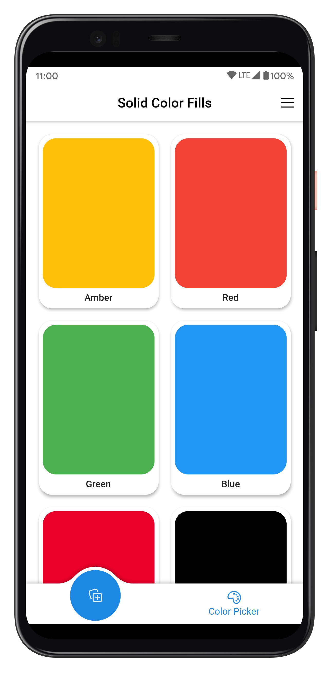
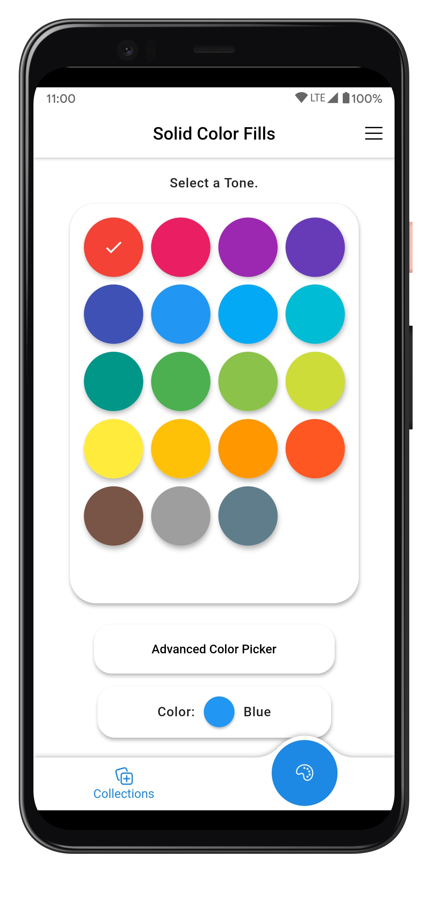
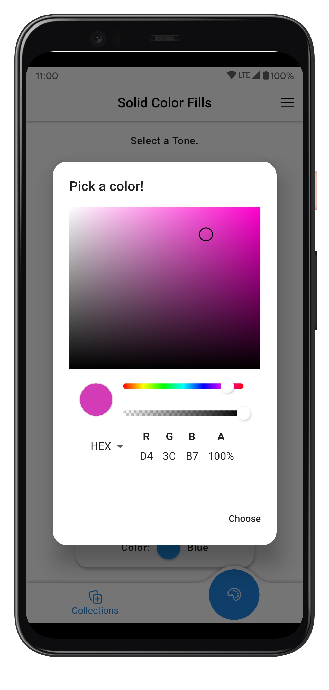
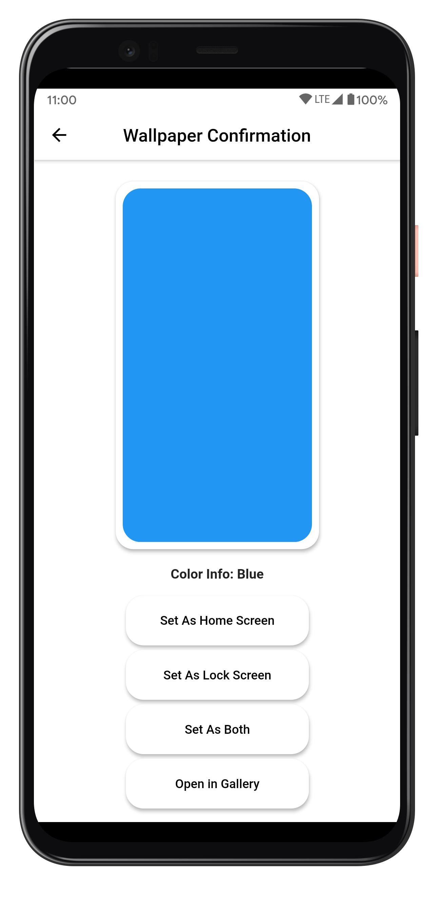

Solid Color Fills
======

An Open-Source app that can set your favourite color as Homescreen or Lockscreen Wallpaper. **Make your device colorful using Solid Color Fills!**

|                                         Collections                                          |                                       Color Picker                                       |
| :------------------------------------------------------------------------------------------: | :--------------------------------------------------------------------------------------: |
|  |  |

|                                          Advanced Color Picker                                          |                                      Wallpaper Selection                                       |
| :-----------------------------------------------------------------------------------------------------: | :--------------------------------------------------------------------------------------------: |
|  |  |

Features
------
* Set any Solid Color as your Device Wallpaper.
* Open Source and Privacy Friendly.
* Minimalistic and Pleasant UI.
* Toggle Light/Dark Theme for the app.
* Various Cherry-Picked Colors to choose from.
* Flexible options like Set as Home Screen only, Open Image in Gallery etc.
* Advanced Color Pickers.
* Built with Latest [Flutter](https://flutter.dev) 2.

Download
------

Notes
------
Set as Lock Screen wallpaper does not work in some systems like MIUI, Realme OS, etc due to system-level restrictions. In such scenarios, you can try open the image in System Gallery app and set as Wallpaper.

Support Me
------
Motivate me by downloading the app directly from Play Store and please write a nice review, Thank you 😃

Credits
------
* Icons made by [Freepik](https://www.freepik.com) from [www.flaticon.com](https://www.flaticon.com)
* App Screenshots created with [MockUPhone](https://mockuphone.com).
